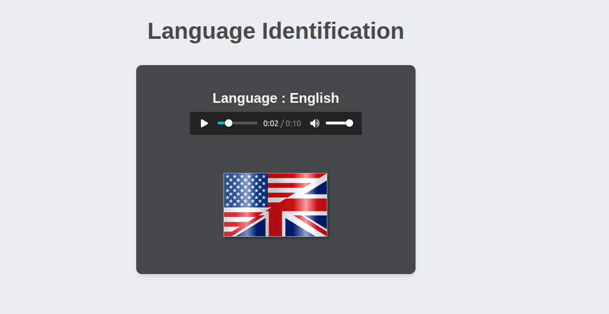

# Spoken Language Identification

## Overview

Spoken Language Identification (LID) is the process of automatically determining the language being spoken in an audio sample. This task is crucial in a wide range of speech-related applications such as speech-to-speech translation, multilingual virtual assistants, and automatic transcription systems. LID systems analyze the characteristics of speech audio and classify it into one of many possible languages.

### DEMO
[Watch](API/media/project.mp4)



## Features*

- **Classification**: Once features are extracted, deep learning algorithms classify the speech into one of several languages.  
- **Language Detection**: Automated language detection from audio samples using a fine-tuned JavaScript.
- **Dockerized Deployment**: Easy deployment using Docker.

## Technologies Used

- **FastAPI**: High-performance framework for building APIs and web applications.
- **Deep Learning Model**: AI model to classify language .
- **Jinja2**: Templating engine for rendering dynamic HTML pages.
- **Docker**: Containerization for consistent deployment across environments.
- **HTML/CSS/JavaScript**: Frontend stack for creating a responsive UI.

## Project Structure
```bash
E2E_Language_Identification/
API/
│
│── main.py           
│── Model/              
│   ├── Checkpoint      
│   ├── inference.py   
│   ├── utilities.py  
│── audio_files/              
│   ├── Spanish.wav
│   ├── English.wav 
│   ├── ....
│── images/              
│   ├── Spanish.png
│   ├── English.png
│   ├── ....
├── static/              
│   └── style.css         
├── templates/           
│   └── index.html       
├── requirements.txt      
├── Dockerfile           
README.md  
Model /
    ├── model.ipynb

```
## Prerequisites

Before running this application, ensure that you have the following installed:

- **[Docker](https://www.docker.com/)**: To build and run the Docker container.
- **[Python 3.8+](https://www.python.org/)**: Required if running locally (without Docker).
- **[FastAPI](https://fastapi.tiangolo.com/)**: Backend framework.
- **[Jinja2](https://jinja.palletsprojects.com/)**: Templating system.

## Getting Started

### Step 1: Clone the Repository

```bash
git clone https://github.com/Shymaa2611/E2E_Language_Identification.git
cd E2E_Language_Identification
```
### Step 2: Build the Docker Image

Build the Docker image for the application:
```bash
docker build -t langimage .
```
### Step 3: RUN Apllication

Once the image is built, run the Docker container:
```bash
docker run -d --name mycontainer -p 80:80 langimage
```
## Access the Application

- The application will run by default at http://127.0.0.1:8000.

## API Documentation

- Access the Swagger documentation for API endpoints at http://127.0.0.1:8000/docs.
